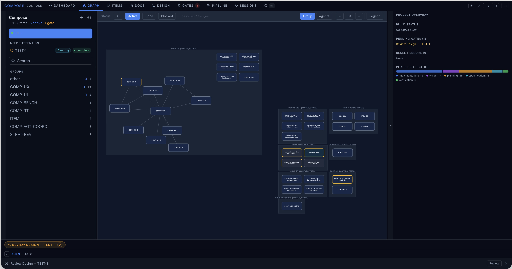

# Compose

Compose is a CLI that drives a product idea from intent to shipped code. It runs YAML-defined multi-step pipelines on top of [Stratum](https://github.com/smartmemory/stratum), dispatching each step to an AI agent (Claude or Codex), checking postconditions, and pausing at human gates between phases. Output: a feature folder with design, blueprint, plan, code, tests, review trail, and an updated `ROADMAP.md` — auditable end-to-end.



## Pitch

- **Gates everywhere** — every phase transition (design, plan, ship) is approve/revise/kill. Human or Codex review at any point.
- **Stratum-backed** — pipelines are declarative `.stratum.yaml` specs with typed contracts, `ensure` postconditions, and retry/`on_fail` routing. Specs are editable.
- **Multi-agent** — Claude (via the Anthropic Agent SDK) and Codex (via the OpenAI CLI) plug in through a uniform connector interface; reviews can run on a different model than implementation.

## 30-second example

```bash
compose new "REST API for managing team todo lists"
  -> questionnaire (interactive)
  -> research (claude) -> brainstorm (claude)
  -> [gate] approve / revise / kill
  -> roadmap (claude) -> [gate] -> scaffold (claude)
  -> done: feature folders + ROADMAP.md ready

compose build TODO-1
  -> design (claude) -> [gate]
  -> blueprint (claude) -> verification (claude)
  -> plan (claude) -> [gate]
  -> decompose + parallel execute (worktree isolation)
  -> claude review lenses + codex review + coverage sweep
  -> docs + ship -> [gate]
  -> done: feature implemented, reviewed, tested, documented
```

## Quick install

Prerequisites: Node.js 18+ and `stratum-mcp` on PATH (`pip install stratum`). Codex steps additionally need the OpenAI `codex` CLI. Full prereqs in [docs/install.md](docs/install.md).

The package is published to npm as `@smartmemory/compose`. Pick one install style:

**Option A — npm (recommended for users):**

```bash
npm install -g @smartmemory/compose
compose setup                # global skill + stratum-mcp registration
```

**Option B — git clone (for development):**

```bash
git clone https://github.com/smartmemory/compose.git && cd compose && npm install
npx @smartmemory/compose setup   # or: node bin/compose.js setup
ln -s "$(pwd)/bin/compose.js" ~/bin/compose && chmod +x ~/bin/compose   # optional: bare `compose` command
```

Then in your project:

```bash
cd /path/to/your/project
compose init                 # writes .compose/, registers MCP, scaffolds ROADMAP and pipeline specs
compose new "what you want to build"
```

Add an isolated feature to an existing project:

```bash
compose feature AUTH-1 "JWT middleware with refresh tokens"
compose build AUTH-1
```

## Upgrading

One command — auto-detects whether compose was installed via npm or git clone:

```bash
compose update
```

For npm installs, this runs `npm install -g @smartmemory/compose@latest`. For git clones, it runs `git pull --ff-only && npm install`. Either way it then refreshes the global skill and (if invoked from inside a Compose project) re-runs `compose init` to refresh `.mcp.json` and pipeline templates. Use `compose update --force` to bypass the dirty-tree check on git clones.

Check what you're running:

```bash
compose --version
```

## Tracker providers

Compose can persist feature data to different backends via the `tracker` block in `.compose/compose.json`.

**Default (local) — zero configuration required:**

```json
{ "tracker": { "provider": "local" } }
```

`local` is the default when no `tracker` block is present. All writes go to the filesystem exactly as before — no behavior change.

**GitHub provider:**

```json
{
  "tracker": {
    "provider": "github",
    "github": {
      "repo": "owner/repo",
      "projectNumber": 42,
      "branch": "main",
      "roadmapPath": "ROADMAP.md",
      "changelogPath": "CHANGELOG.md",
      "cacheTtlSeconds": 300,
      "auth": { "tokenEnv": "GITHUB_TOKEN" }
    }
  }
}
```

The GitHub provider syncs features to **Issues** (one per feature), **Projects v2** (`Status` custom field), and **Contents API** (roadmap + changelog files). Requires a token in the named env var (or `gh auth login` fallback) with `repo` and `project` scopes.

CLI verbs:

```bash
compose tracker status   # show provider health + pending op-log + conflict ledger
compose tracker sync     # reconcile op-log against remote provider
```

See [docs/configuration.md](docs/configuration.md) for the full `tracker` config reference.

## Documentation

Topic-scoped reference:

- [docs/install.md](docs/install.md) — prerequisites, `compose init`, `compose setup`, `~/bin` symlink, `compose install` compatibility shim.
- [docs/cli.md](docs/cli.md) — every subcommand (`new`, `import`, `feature`, `build`, `pipeline`, `init`, `setup`, `doctor`, `start`).
- [docs/cockpit.md](docs/cockpit.md) — web UI shell: zones, graph view, context panel, ops strip, agent bar, persistence.
- [docs/pipelines.md](docs/pipelines.md) — kickoff and build pipelines, sub-flows, contracts, `on_fail` routing, Stratum IR v0.3.
- [docs/agents.md](docs/agents.md) — agent connectors, message envelope, Claude/Codex/Opencode connectors, registry.
- [docs/lifecycle.md](docs/lifecycle.md) — questionnaire, gate system, validation, recovery, progress logging, vision tracker, result normalization.
- [docs/configuration.md](docs/configuration.md) — `.compose/*.json`, pipeline specs, `.mcp.json`, `ROADMAP.md`, environment variables.
- [docs/mcp.md](docs/mcp.md) — MCP server tool list (vision, lifecycle, gates, iteration loops).
- [docs/examples.md](docs/examples.md) — worked workflows and the full `compose pipeline` editing reference.
- [docs/command-flows.md](docs/command-flows.md) — mermaid flow diagrams for every CLI verb (`build`, `fix`, `gsd`, `new`, `import`, `feature`, `roadmap`, `triage`, `qa-scope`, `pipeline`, `init`/`setup`/`update`/`doctor`).

### Specs and design

- [docs/PRD.md](docs/PRD.md)
- [docs/PRODUCT-SPEC.md](docs/PRODUCT-SPEC.md)
- [docs/ROADMAP.md](docs/ROADMAP.md)
- [docs/taxonomy.md](docs/taxonomy.md)
- [docs/compose-one-pager.md](docs/compose-one-pager.md)
