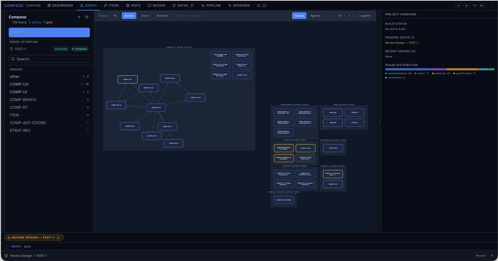

# Compose

### Structured AI dev pipeline: goal to shipped code, with gates that hold

#### *Your agent writes the code. Compose makes it prove it.*

> Describe what you want. Compose decomposes it, forces the design decisions before any code is written, hands each step to the right agent, and refuses to advance until that step proves it is done. What comes back is a feature folder with the design, the blueprint, the plan, the code, the tests, and the full review trail. Auditable end to end.



## The problem

An agent finishes, reports done, and the suite is green. Weeks later you find the feature. It exists, it has tests, and nothing calls it. The tests exercise a path that real data never enters.

Nobody lied. The agent did what it was asked, the tests assert what they assert, and no step in between ever had to prove the thing was wired to anything. That gap does not show up in a diff review. It shows up in production, or it never shows up at all, which is worse.

Compose sits above Claude Code and Codex rather than in place of them. It decides what the next step is, hands it to whichever agent should do it, and will not advance until the step proves it finished.

## Who it's for

- **Solo builders and small teams** shipping more code each week than they can personally review, who need something other than trust to decide when a feature is really done
- **Tech leads reviewing agent output** who keep finding work that passes its own tests and is wired to nothing
- **Anyone running more than one agent** (Claude for implementation, Codex for review) who wants the same standard applied no matter which model did the work
- **Developers who lose the thread at a session boundary** and want the plan, the decisions, and the open questions to outlive the context window instead of living in chat scrollback
- **Maintainers whose roadmap has drifted from reality** and want status derived from what actually shipped rather than from what someone remembered to update
- **Teams who have to explain a decision months later**, what was chosen, what was rejected and why, and cannot reconstruct any of it from a diff

## Why Compose

| | Prompting the agent directly | A plan.md or TODO list | **Compose** |
| --- | --- | --- | --- |
| **Definition of done** | Whatever the agent says | A checkbox someone ticks | Postconditions checked before the step can pass |
| **Design decisions** | In the chat, then gone | Sometimes written down | Recorded artifacts, gated before any code |
| **Survives a session boundary** | No, only scrollback | The text, not the reasoning | Feature folder: design, blueprint, plan, review trail |
| **Review** | Whenever you remember | Manual | Enforced at every gate, and runnable on a different model than the one that wrote the code |
| **Catches wired-to-nothing code** | No | No | Implementation review keyed to wiring, not only to tests |
| **Roadmap status** | Manual | Manual, and it drifts | Generated from what actually shipped |
| **Recovery mid-build** | Start over | Re-read and guess | Resume from recorded state |

## How it holds the line

- **Gates everywhere.** Every phase transition (design, plan, ship) is approve, revise, or kill. Human or Codex review at any point.
- **Stratum-backed.** Pipelines are declarative `.stratum.yaml` specs with typed contracts, `ensure` postconditions, and retry/`on_fail` routing. Specs are editable.
- **Multi-agent.** Claude (via the Anthropic Agent SDK) and Codex (via the OpenAI CLI) plug in through a uniform connector interface. Reviews can run on a different model than implementation.

## 30-second example

```bash
compose new "REST API for managing team todo lists"
  -> questionnaire (interactive)
  -> research (claude) -> brainstorm (claude)
  -> [gate] approve / revise / kill
  -> roadmap (claude) -> [gate] -> scaffold (claude)
  -> done: feature folders + ROADMAP.md ready

compose build TODO-1
  -> design (claude) -> [gate]
  -> blueprint (claude) -> verification (claude)
  -> plan (claude) -> [gate]
  -> decompose + parallel execute (worktree isolation)
  -> claude review lenses + codex review + coverage sweep
  -> docs + ship -> [gate]
  -> done: feature implemented, reviewed, tested, documented
```

Starting from a fuzzy goal instead of a known feature? Use the planning lifecycle:

```bash
compose plan "a tool that summarizes my team's standups"
  -> frame + research + ideate (ideas go to the ideabox) -> [gate]
  -> converge + estimate -> writes build-ready feature.json + design.md -> [gate]
  -> handoff: each feature ready for `compose build <CODE>`
```

`compose build` then picks up a plan-authored feature and ratifies its design rather than rewriting it.

Bundled [team presets](docs/team-presets.md): `feature` (parallel implementation),
`research` (parallel exploration), `review` (parallel review), and `fable-astra`:

```bash
compose build FEAT-1 --team fable-astra
```

Fable plans independent tasks, Codex workers implement in isolated worktrees, and
a fresh read-only Astra reviewer checks the merged result after verification.
Fable then requests another implementation or repair wave, declares the work
blocked, or approves ship into one base-parent commit. Concurrency is 3; the
$150 cost ceiling is overridable with `--cost-ceiling-usd`. See the
[loop and limits](docs/pipelines.md#fable-astra-wave-loop).

## Quick install

Prerequisites: Node.js 18+. [Stratum](https://github.com/smartmemory/stratum) needs no separate install — `@smartmemory/stratum` is a dependency, and `compose init` registers the installed copy's MCP entrypoint automatically (a sibling `stratum/` checkout is a development convenience, not a requirement; the python `stratum-mcp` PyPI package is retired). Codex steps additionally need the OpenAI `codex` CLI. Full prereqs in [docs/install.md](docs/install.md).

The package is published to npm as `@smartmemory/compose`. Pick one install style:

**Option A — npm (recommended for users):**

```bash
npm install -g @smartmemory/compose
compose setup                # install bundled skills, auto-install missing required plugins, register the Stratum MCP server (alias: compose sync)
```

**Option B — git clone (for development):**

```bash
git clone https://github.com/smartmemory/compose.git && cd compose && npm install
npx @smartmemory/compose setup   # or: node bin/compose.js setup
ln -s "$(pwd)/bin/compose.js" ~/bin/compose && chmod +x ~/bin/compose   # optional: bare `compose` command
```

Then in your project:

```bash
cd /path/to/your/project
compose init                 # writes .compose/, registers MCP, scaffolds ROADMAP, pipeline specs, contracts/vocabulary.yaml
compose new "what you want to build"
```

Add an isolated feature to an existing project:

```bash
compose feature AUTH-1 "JWT middleware with refresh tokens"
compose build AUTH-1
```

## Upgrading

One command — auto-detects whether compose was installed via npm or git clone:

```bash
compose update
```

Versions across the three published packages move together: `@smartmemory/compose-mcp` carries
compose's exact version, and `@smartmemory/compose` shares a minor with `@smartmemory/stratum`
(patches move independently). So compose 0.4.x pairs with stratum 0.4.x. See
[.claude/rules/versioning.md](.claude/rules/versioning.md).

For npm installs, this runs `npm install -g @smartmemory/compose@latest`. For git clones, it runs `git pull --ff-only && npm install`. Either way it then refreshes the global skill and (if invoked from inside a Compose project) re-runs `compose init` to refresh `.mcp.json` and pipeline templates. Use `compose update --force` to bypass the dirty-tree check on git clones.

Check what you're running:

```bash
compose --version
```

## Bundled skills

`compose setup` (alias `compose sync`) mirrors compose-owned skills into your agent skill dirs (`~/.claude/skills/`, shared with Codex). Re-run it after a `compose update` or after editing skills locally — it's idempotent.

- **`/compose`** — the build/fix lifecycle orchestrator (idea → design → blueprint → implement; or triage → fix → verify).
- **`/context-budget`** — read-only audit of the session-start loaded surface (agents, skills, rules, MCP tool schemas, CLAUDE.md chain). Estimates per-component token cost, classifies each into always / sometimes / rarely needed, and prints a ranked cut list with estimated reclaim. Never auto-applies cuts.

`compose update` fetches a newer compose (npm or git) and then runs setup for you; use `compose sync` when there's no new version to pull — you just changed skills locally.

## Tracker providers

Compose can persist feature data to different backends via the `tracker` block in `.compose/compose.json`.

**Default (local) — zero configuration required:**

```json
{ "tracker": { "provider": "local" } }
```

`local` is the default when no `tracker` block is present. All writes go to the filesystem exactly as before — no behavior change.

**GitHub provider:**

```json
{
  "tracker": {
    "provider": "github",
    "github": {
      "repo": "owner/repo",
      "projectNumber": 42,
      "branch": "main",
      "roadmapPath": "ROADMAP.md",
      "changelogPath": "CHANGELOG.md",
      "cacheTtlSeconds": 300,
      "auth": { "tokenEnv": "GITHUB_TOKEN" }
    }
  }
}
```

The GitHub provider syncs features to **Issues** (one per feature), **Projects v2** (`Status` custom field), and **Contents API** (roadmap + changelog files). Requires a token in the named env var (or `gh auth login` fallback) with `repo` and `project` scopes.

CLI verbs:

```bash
compose tracker status   # show provider health + pending op-log + conflict ledger
compose tracker sync     # reconcile op-log against remote provider
```

See [docs/configuration.md](docs/configuration.md) for the full `tracker` config reference.

## Backfilling a completion (guarded workspaces)

Sometimes a feature is finished before its lifecycle was ever walked: it shipped before Compose existed, or the guard was switched off at the time. Compose can record that completion with evidence instead of an override token. Call the MCP tool `backfill_completion` (or `POST /api/vision/items/:id/lifecycle/backfill`) with the completing commit, a test attestation, a reason, and dated phase occurrences. The gate verifies the evidence, merges the occurrences into the phase history by their real dates, and moves the guard to `complete_backfilled`. Readers and the UI show which entries were backfilled.

Features that were never registered with the guard need nothing else. Features registered before this release carry an older policy, and the guard will only accept the new one under a signed upgrade descriptor. The signature is the one thing an agent must never be able to produce on its own, so it is the one thing a human confirms:

- **Once per Mac:** run `compose guard enrol` from a terminal. It installs a root-owned signing key and signer under `/Library/Compose/guard/`, a `sudo` rule that always re-authenticates (Touch ID via `pam_tid`), enrols the public key in stratum's trust root, and verifies the round trip. Two Touch ID prompts, then `done`.
- **Every later signature is one Touch ID prompt.** When a backfill needs a descriptor that is not yet signed, the gate generates it, asks, verifies, and continues. Nothing else is manual. `compose guard sign` does the same explicitly and `compose guard status` shows custody, enrolment, descriptor freshness and whether the signed generations are committed.

Signed descriptors live in `.compose/guard-upgrades/<sha256>/` (immutable) with `current` pointing at the live generation; commit them like any other workspace canon. A backfill refuses with `signature_not_approved` when the prompt is cancelled or cannot be shown (SSH session, `tmux` without `pam_reattach`), and with `upgrade_descriptor_unavailable` on a machine that has not run `enrol`. Admins who want the "one approval, one signature" property to hold against their own other `sudo` use can add `Defaults timestamp_timeout=0` to sudoers. Without macOS custody (Linux, CI), `compose guard descriptors` still writes the unsigned candidate and prints the `ssh-keygen -Y sign` command for an operator key.

## Remote access (mobile PWA from anywhere)

The mobile cockpit at `/m` can be reached from outside localhost — bring your own tunnel, compose handles auth and pairing:

```bash
npm run build                                  # source checkouts only; the npm package already ships dist/
COMPOSE_REMOTE_AUTH=enabled compose start --host=0.0.0.0
compose remote pair --public-host=https://your-tunnel-host   # prints a QR — scan it with your phone
compose remote status                          # bind, devices, tunnel reachability
```

How it works: binding beyond `127.0.0.1` refuses to start unless `COMPOSE_REMOTE_AUTH=enabled` is set. In remote mode every request needs a credential — there is deliberately **no IP-based trust** (tunnel daemons connect from loopback). Phones pair once via QR (5-minute single-use code) and stay authenticated for 30 days through rotating refresh tokens + 15-minute access JWTs; reuse of a rotated refresh token revokes the device. Devices are listable and revocable (`compose remote list|revoke`, or the cockpit's "Pair mobile" modal). Only port 4001 needs to be exposed — agent-server traffic is proxied through it.

Tunnel layer is yours: Tailscale (serve/funnel), Cloudflare Tunnel, or a reverse proxy on your own VPS+domain all work — the last is the most reliable from restrictive networks (e.g. mainland China, where `trycloudflare.com`/ngrok domains are commonly blocked; plain TLS on 443 to an unremarkable domain travels best). Pair the device *before* traveling: pairing needs a live round-trip, while an already-paired phone only needs refresh.

`compose remote rotate-secret --yes` invalidates every paired device (post-leak hammer).

## SmartMemory coupling (opt-in)

Compose can feed its own lifecycle history (feature events, gate decisions, journal entries,
artifacts) into [SmartMemory](https://github.com/smartmemory) for relevance-ranked recall,
via a `smartmemory` block in `.compose/compose.json`:

```json
{
  "smartmemory": {
    "enabled": true,
    "baseUrl": "http://localhost:9001",
    "apiKeyEnv": "SMARTMEMORY_API_KEY",
    "timeoutMs": 3000
  }
}
```

`smartmemory` is absent by default, which means the coupling is fully off: no probes, no
network calls, no new log lines. With `enabled: true` and a reachable SmartMemory service,
compose ingests lifecycle events live (fail-open) and the cockpit gains a Recall tab on each
feature's detail panel.

```bash
compose smartmemory sync                 # idempotent backfill of events, journal, artifacts
compose smartmemory sync --dry-run       # preview counts without ingesting
compose smartmemory sync --feature CODE  # scope the sync to one feature
```

### Maya colleague panel (opt-in, requires the SmartMemory service stack)

With the SmartMemory fluid provider configured, a `maya` block summons Maya (the SmartMemory
assistant) as a colleague inside the cockpit: a slide-over panel where you discuss ideas while
Compose computes the memory findings (challenge, conviction, contradictions) and hands them to
her as per-turn context. Her replies about a focused idea append to its discussion trail as
`author: maya`.

```json
{
  "maya": {
    "baseUrl": "http://localhost:9005",
    "auth": { "mode": "provision" }
  }
}
```

`auth.mode` is `provision` (a dedicated colleague identity minted lazily against the local
smart-memory-service test surface) or `static` (paste a token in the panel; it is verified
against the service before being stored). The colleague never runs degraded: without the
SmartMemory provider the panel explains what to connect instead of falling back to plain chat,
and capabilities the provider does not declare render as visibly unavailable.

## Documentation

Topic-scoped reference:

- [docs/install.md](docs/install.md) — prerequisites, `compose init`, `compose setup`, `~/bin` symlink, `compose install` compatibility shim.
- [docs/cli.md](docs/cli.md) — every subcommand (`new`, `import`, `feature`, `build`, `pipeline`, `init`, `setup`, `doctor`, `start`).
- [docs/cockpit.md](docs/cockpit.md) — web UI shell: zones, graph view, context panel, ops strip, agent bar, persistence.
- [docs/pipelines.md](docs/pipelines.md) — kickoff and build pipelines, sub-flows, contracts, `on_fail` routing, Stratum IR v0.3.
- [docs/agents.md](docs/agents.md) — agent connectors, message envelope, Claude/Codex/Opencode connectors, registry.
- [docs/lifecycle.md](docs/lifecycle.md) — questionnaire, gate system, validation, recovery, progress logging, vision tracker, result normalization.
- [docs/configuration.md](docs/configuration.md) — `.compose/*.json`, pipeline specs, `.mcp.json`, `ROADMAP.md`, environment variables.
- [docs/mcp.md](docs/mcp.md) — MCP server tool list (vision, lifecycle, gates, iteration loops).
- [docs/examples.md](docs/examples.md) — worked workflows and the full `compose pipeline` editing reference.
- [docs/command-flows.md](docs/command-flows.md) — mermaid flow diagrams for every CLI verb (`build`, `fix`, `gsd`, `new`, `import`, `feature`, `roadmap`, `triage`, `qa-scope`, `pipeline`, `init`/`setup`/`update`/`doctor`).

### Specs and design

- [docs/PRD.md](docs/PRD.md)
- [docs/PRODUCT-SPEC.md](docs/PRODUCT-SPEC.md)
- [docs/ROADMAP.md](docs/ROADMAP.md)
- [docs/taxonomy.md](docs/taxonomy.md)
- [docs/compose-one-pager.md](docs/compose-one-pager.md)
