# Compose Command Flows

Mermaid flow diagrams for every `compose` CLI verb. Rendered inline on GitHub and in the cockpit's Docs view.

Three primary lifecycles (`build`, `fix`, `gsd`) drive feature/bug development. The remaining commands are scaffolding, housekeeping, and observability.

---

## `compose build <feature-code>`

Headless feature lifecycle. Spec: [`pipelines/build.stratum.yaml`](../pipelines/build.stratum.yaml). Entry: [`lib/build.js`](../lib/build.js) `runBuild`.

```mermaid
flowchart TD
    Start([compose build CODE]) --> Triage{auto-triage?}
    Triage -->|yes| TriageRun[Pre-build triage:<br/>profile + skip toggles]
    Triage -->|skip| Design
    TriageRun --> Design

    Design[Phase 1: explore_design<br/>writes design.md] --> DesignGate{design_gate}
    DesignGate -->|approve| PRD
    DesignGate -->|revise| Design
    DesignGate -->|kill| Killed([killed.md])

    PRD[Phase 2: prd<br/>skippable] --> Arch
    Arch[Phase 3: architecture<br/>skippable] --> Blueprint

    Blueprint[Phase 4: blueprint<br/>file:line refs +<br/>optional Boundary Map] --> Verify
    Verify[Phase 5: verification<br/>boundary-map.js validator]
    Verify -->|stale refs| Blueprint
    Verify -->|clean| Plan

    Plan[Phase 6: plan<br/>tasks + acceptance] --> PlanGate{plan_gate}
    PlanGate -->|approve| Decompose
    PlanGate -->|revise| Plan

    Decompose[Phase 7a: decompose<br/>TaskGraph w/<br/>files_owned] --> Execute

    Execute[Phase 7b: execute<br/>parallel_dispatch<br/>max_concurrent: 3<br/>isolation: worktree<br/>merge: sequential_apply]

    Execute --> Review
    Review[Phase 7c: parallel_review<br/>Claude lenses]
    Review -->|findings| Execute
    Review -->|clean| Codex

    Codex[Phase 7d: codex_review<br/>independent cross-model]
    Codex -->|findings| Execute
    Codex -->|clean| Coverage

    Coverage[Phase 7e: coverage<br/>test suite<br/>retries: 15]
    Coverage -->|fail| Coverage
    Coverage -->|pass| Report

    Report[Phase 8: report<br/>skippable] --> Docs
    Docs[Phase 9: docs<br/>CHANGELOG, ROADMAP,<br/>README, CLAUDE.md]
    Docs --> Ship

    Ship[Phase 10: ship<br/>tests + build +<br/>commit in-process]
    Ship --> ShipGate{ship_gate}
    ShipGate -->|approve| Done([COMPLETE])
    ShipGate -->|revise| Ship

    classDef gate fill:#fef3c7,stroke:#d97706,stroke-width:2px
    classDef terminal fill:#dbeafe,stroke:#2563eb
    classDef killed fill:#fee2e2,stroke:#dc2626
    class DesignGate,PlanGate,ShipGate,Triage gate
    class Start,Done terminal
    class Killed killed
```

**Flags:** `--through <phase>` partial run, `--abort`, `--resume`, `--skip-triage`, `--template <name>`, `--cwd <path>`.

---

## `compose fix <bug-code>`

Headless bug-fix lifecycle. Spec: [`pipelines/bug-fix.stratum.yaml`](../pipelines/bug-fix.stratum.yaml). Eight steps with hard-bug machinery (hypothesis ledger, two-tier escalation, bisect).

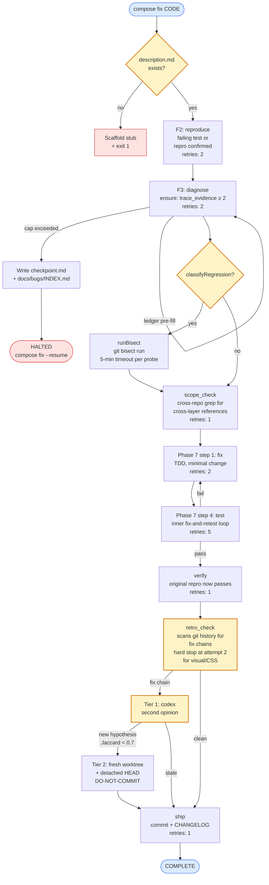

**Paths:** Quick (known root cause + single file) collapses F2/F3 → Fix. Hotfix time-boxes F3 with `// HOTFIX:` follow-up.
**Flags:** `--abort`, `--resume`, `--cwd <path>`.

---

## `compose gsd <feature-code>`

Per-task fresh-context dispatch (COMP-GSD-2). Spec: [`pipelines/gsd.stratum.yaml`](../pipelines/gsd.stratum.yaml). Entry: [`lib/gsd.js`](../lib/gsd.js) `runGsd`.

```mermaid
flowchart TD
    Start([compose gsd CODE]) --> CheckBP{blueprint.md<br/>exists?}
    CheckBP -->|no| ErrorBP[Error:<br/>run compose build CODE first]
    CheckBP -->|yes| ValidateBM

    ValidateBM{validateBoundaryMap<br/>.ok === true?}
    ValidateBM -->|no| ErrorBM[Error: BM invalid<br/>+ violations list]
    ValidateBM -->|yes| Clean

    Clean{git workspace<br/>clean?}
    Clean -->|no| ErrorDirty[Error: commit or stash<br/>(allowDirtyWorkspace<br/>opt-in for advanced)]
    Clean -->|yes| GateCommands

    GateCommands[Resolve gateCommands<br/>compose.json or defaults<br/>pnpm lint/build/test] --> Plan

    Plan[stratum.plan<br/>gsd.stratum.yaml<br/>inputs: featureCode +<br/>gateCommands] --> Decompose

    Decompose[Step 1: decompose_gsd<br/>agent reads blueprint.md +<br/>Boundary Map →<br/>TaskGraph w/ rich descriptions]
    Decompose --> Enrich

    Enrich{enrichTaskGraph<br/>structural check}
    Enrich -->|orphan slice/task| FailLoud[Throw loud<br/>no repair path]
    Enrich -->|valid + sections OK| Execute
    Enrich -->|valid + missing<br/>section markers| Repair

    Repair[buildTaskDescription<br/>per-task fallback<br/>6 sections from slice +<br/>upstream + gates]
    Repair --> Execute

    Execute[Step 2: execute<br/>parallel_dispatch<br/>max_concurrent: 1<br/>isolation: worktree<br/>capture_diff: true<br/>merge: sequential_apply<br/>retries: 2]

    Execute --> TaskAgent
    TaskAgent[Each task agent:<br/>TDD implement +<br/>run gateCommands +<br/>write per-task<br/>TaskResult JSON]
    TaskAgent --> MergeDiffs

    MergeDiffs[applyServerDispatchDiffsCore<br/>topological merge to base cwd<br/>per-task .json lands at<br/>.compose/gsd/CODE/results/]

    MergeDiffs --> CaptureFiles[Capture filesChanged<br/>via git diff]
    CaptureFiles --> Ship

    Ship[Step 3: ship_gsd<br/>executeShipStep in-process<br/>stages filesChanged +<br/>ROADMAP/CHANGELOG/CLAUDE<br/>+ commit<br/>(push deferred to user)]

    Ship --> Blackboard
    Blackboard{collectBlackboard<br/>validate each<br/>TaskResult}
    Blackboard -->|any invalid| FailLoudBB[Throw loud<br/>list all failures<br/>no partial blackboard]
    Blackboard -->|all valid| WriteBB

    WriteBB[writeAll<br/>blackboard.json<br/>one-shot replace +<br/>mkdir lock]
    WriteBB --> Done([COMPLETE])

    classDef precond fill:#fef3c7,stroke:#d97706,stroke-width:2px
    classDef terminal fill:#dbeafe,stroke:#2563eb
    classDef error fill:#fee2e2,stroke:#dc2626
    classDef sentinel fill:#e0e7ff,stroke:#6366f1
    class CheckBP,ValidateBM,Clean,Enrich,Blackboard precond
    class Start,Done terminal
    class ErrorBP,ErrorBM,ErrorDirty,FailLoud,FailLoudBB error
    class Repair sentinel
```

**Flags:** `--cwd <path>`. `{allowDirtyWorkspace: true}` opt-in via programmatic API.

**v1 limits:** sequential only (`max_concurrent: 1`); no runtime task-to-task handoff (tasks see spec-level upstream context only); no per-task gate bounce-back (gates run inside each agent's TDD loop). GSD-3..7 extend.

---

## `compose new`

Kickoff a product: research → brainstorm → initial roadmap → scaffold.

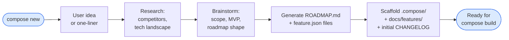

---

## `compose import`

Scan an existing project and generate structured analysis.

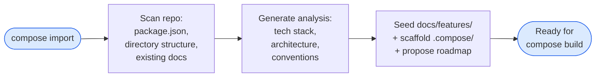

---

## `compose feature <code>`

Add a single feature: folder + design seed + ROADMAP row.

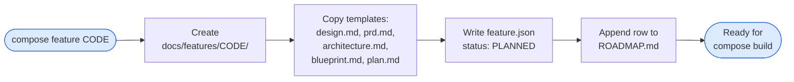

---

## `compose roadmap [generate|migrate|check]`

Source-of-truth is `feature.json`; ROADMAP.md is generated.

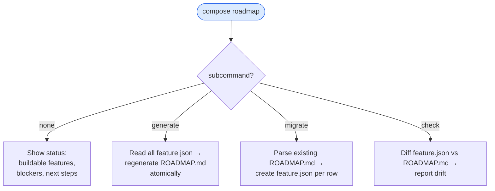

---

## `compose triage <feature-code>`

Analyze a feature and recommend build profile.

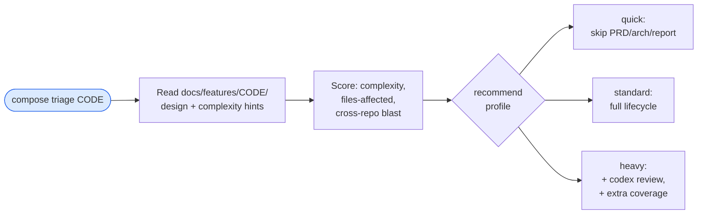

---

## `compose qa-scope <feature-code>`

Show affected routes from a feature's changed files. Read-only.

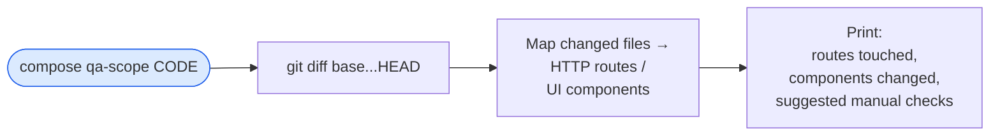

---

## `compose pipeline`

View / edit `.stratum.yaml` pipelines.

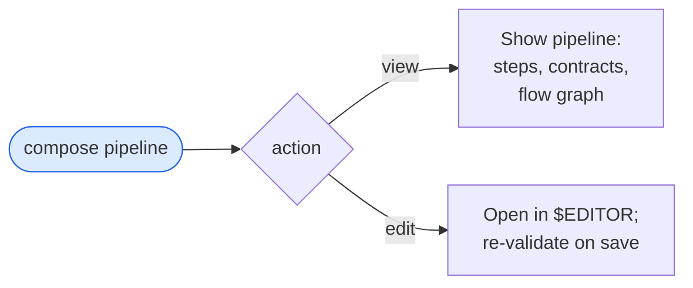

---

## Setup commands (`init`, `setup`, `update`, `doctor`)

```mermaid
flowchart TD
    subgraph init [compose init - project-local]
        I1[Create .compose/compose.json] --> I2[Scaffold docs/, pipelines/]
        I2 --> I3[Install hooks]
    end

    subgraph setup [compose setup - user-global]
        S1[Install ~/.claude/skills/compose/] --> S2[Register stratum-mcp<br/>in ~/.claude/settings.json]
        S2 --> S3[Sync vendored skills]
    end

    subgraph update [compose update]
        U1[git pull latest compose] --> U2[npm install]
        U2 --> U3[Re-sync skill files]
    end

    subgraph doctor [compose doctor]
        D1[Check stratum-mcp installed] --> D2[Check external skill deps]
        D2 --> D3[Print install commands<br/>for missing pieces]
    end
```

---

## Lifecycle overview

The three primary verbs map to feature lifecycle stages:

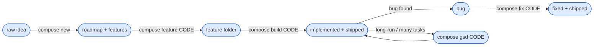

`compose build` is the default. `compose fix` handles non-trivial bugs (with hard-bug escalation machinery). `compose gsd` runs an existing blueprint as per-task fresh-context dispatch — the load-bearing primitive for long autonomous runs (COMP-GSD-2).
